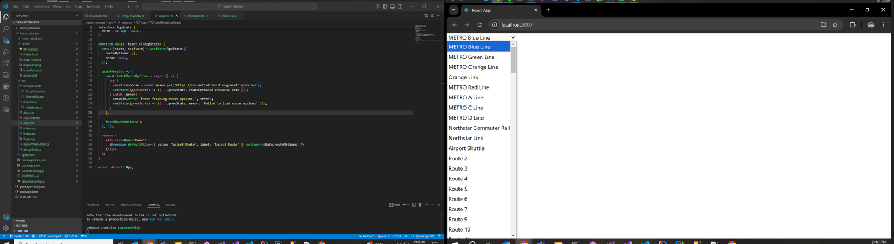
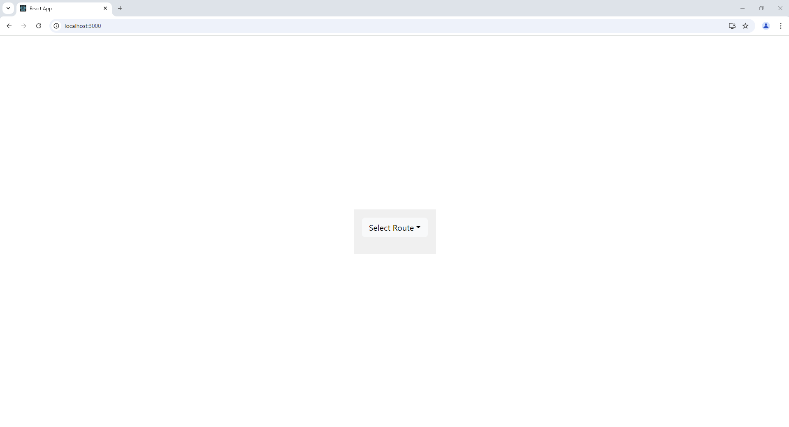
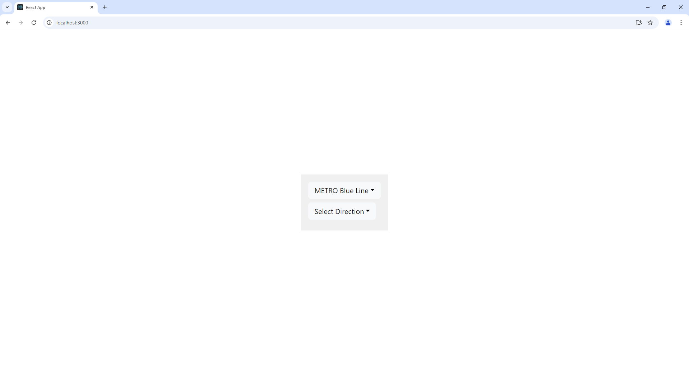
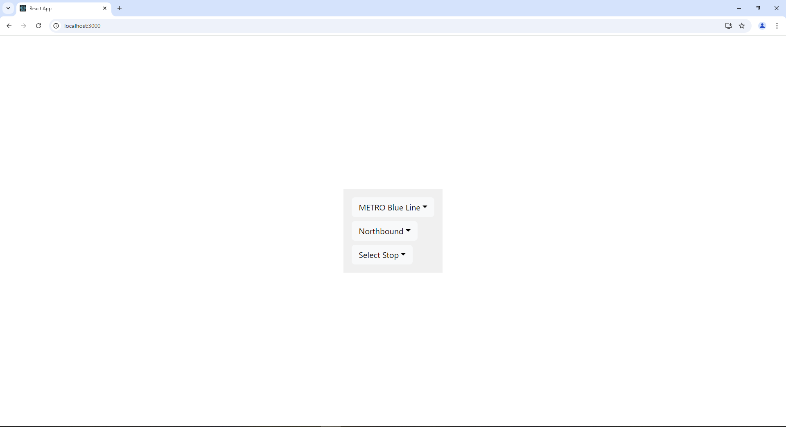
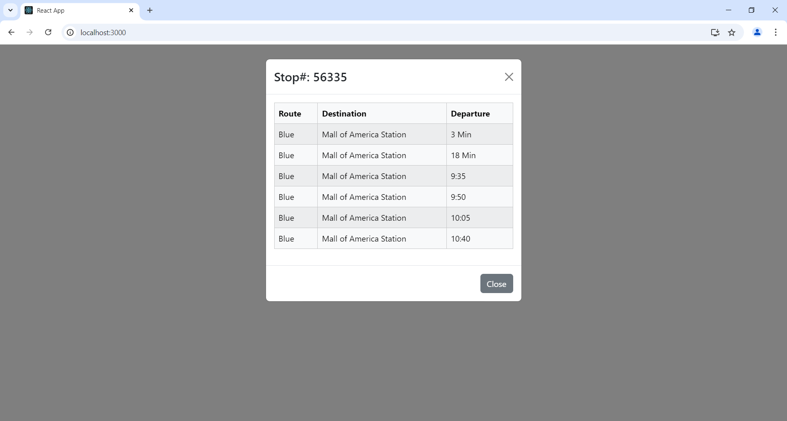
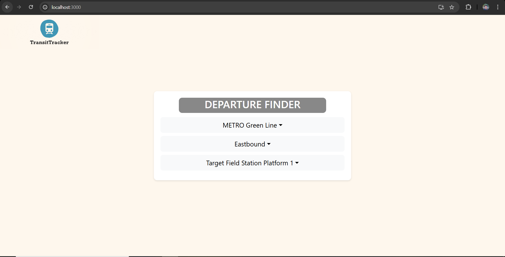
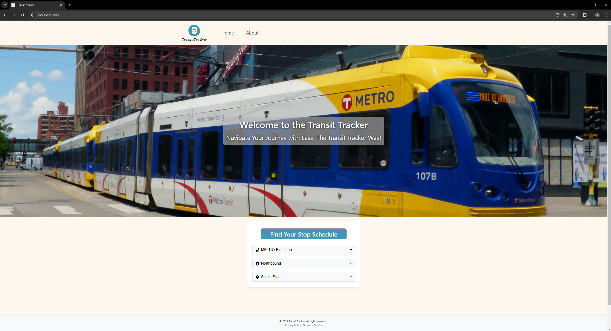

# TransitTracker Case Study

## Framework Version
- NPM Version: 10.2.4
- Node Version: 20.11.0
- React Version 19.0.0
- HTTP Request Lib: Axios

## Working Notes

### Day 1
- Took a look at https://www.metrotransit.org/ as a reference and the swagger endpoint at https://svc.metrotransit.org/swagger/index.html.
    - Seems like a pretty straight forward at how they handle the data. There is definitely some result passing from call to call.
    - Starting off with a basic UI. Don't see a point in building out another custom Node REST API as of now, data washing seems largely unnecessary in this case.
    - Honestly, MetroTransit does a lot of things very well already. Their initial drop down holds your hand through the process and the scheduling list is very clean. I will try and keep this functionality in my design.

- Chipping away are required requirements first, starting with a search bar

- Importing React Bootstrap for web page styling - Just a personal choice

### First Step:
- Seeing if I can get a list of Stop options to auto populate on page entry and filter as user types into the input box
- **Note**: Using GPT to generate stylings for me for first run. Probably not worth it for me to sit on CSS the entire time for the case study. Will add in my own touches towards the end.

- Milestone 1: Populated dropdown with the Routes Data:

### Second Step:
- Render direction and step dropdowns accordingly with correct data from API

- Struggle Point: Handling when to load new option data and resolve back to a default label. For example: If the user selectes a route and then deselects a route, it should handle the options for the routing and direction dropdowns. There is a lot of overlap points, but this needs to be handled elegantly via state management.
    - Solved this issue by moving some functionality to the change handler and strengthening if conditions

- Struggle Point 2: If the async function is called one after another fast enough, there is potential that it loads options two times over
    - Fixed by rebuilding an array instead of appending onto an existing reference
    
- Milestone 2: Created all three dropdowns and added conditional rendering for when a previous dropdown is selected. Noticed there was a bug with the metro transit site when you select all options and then change your route.

### Third Step:
- Render popup with Stop List when all dropdowns have been selected

- Milestone 3: Got popup to render with departure data

### Fourth Step:
- Seems that we met the minimum requirements, we are able to see the routes, directions, stops, and pull up a table of all the departures from a specific stop. Now is the CSS portion. This will be in iterative process.

- Milestone 4a: Some CSS to spice things up - definitely not the best, but it looks better than before

### Day 2
- Milestone 4b: Complete CSS overhaul. Added an image banner, navbar (dummy navbar) and reworked the color schemes of the page. Also added a footer and change the web tabular

### Fifth Step
- While I am generally content with the CSS, some minor tweaks could be made to the table popup. Additionally, I wouldd like to look more into browser back and fourth arrow functionality.
- Debating whether or not I want to change the behavior when the popup also goes back into hide mode... Currently, if the user closes the popup all the previous options are still selected. The only issue with this is that if the user wants to pull the popup up again, they need to reselect the dropdown option. This could be solved by clearing the stop dropdown as the metro site does or introducing a button
